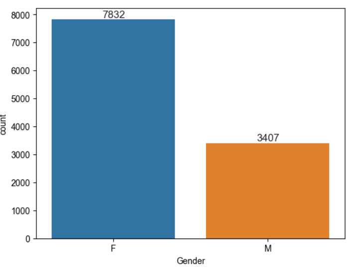
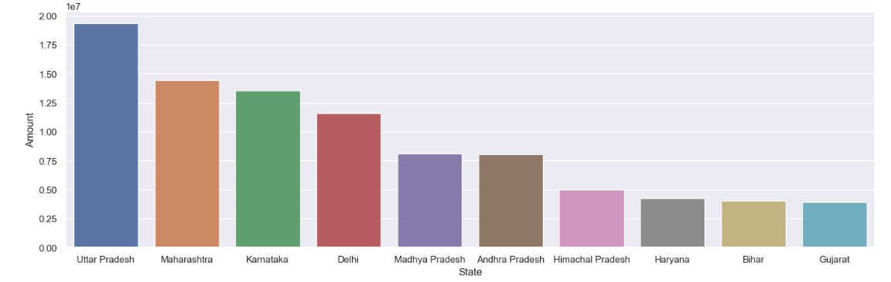

# Diwali Sales Analysis

## 1. Background and Overview

The Diwali season is a critical retail period in India, characterized by increased consumer spending. This project analyzes a comprehensive dataset of customer demographics, purchasing behaviors, and product sales during Diwali. The objective of the analysis is to extract actionable insights that can aid in refining marketing strategies, optimizing inventory, and driving revenue growth for businesses.

The dataset provides detailed information on customer behavior segmented by demographics such as age, gender, occupation, marital status, and regional data.

---

## 2. Data Structure Overview

The dataset consists of several key variables that form the basis of the analysis:

- **User_ID**: Unique identifier for each customer.
- **Cust_name**: Name of the customer.
- **Product_ID**: Unique identifier for each product.
- **Gender**: Customer’s gender (Male/Female).
- **Age Group**: Age category of the customer.
- **Marital_Status**: Marital status of the customer (Married/Unmarried).
- **State**: The state where the purchase was made.
- **Occupation**: Customer's profession.
- **Product_Category**: Product classification.
- **Orders**: Number of orders placed by the customer.
- **Amount**: Total expenditure by the customer.

This data allows us to analyze trends across multiple dimensions such as purchasing behavior by gender, region, and occupation.

---

## 3. Executive Summary

This analysis provides data-driven insights into the purchasing trends during the Diwali sales period. Key highlights include:

- **Gender-Based Purchasing Power**: 
  - Female customers exhibit a stronger purchasing power compared to male customers, driving a larger portion of the sales.  
  - **55%** of buyers are female, and they contribute to a higher total spending in categories like clothing and electronics.
  
- **Age Group Preferences**:
  - **65%** of buyers fall within the **26-35 age group**, predominantly women, indicating that this demographic is highly engaged during the Diwali sales season.
  
- **Regional Sales Leaders**:
  - Uttar Pradesh, Maharashtra, and Karnataka contribute the most to total sales, with these three states representing over **40%** of the total orders and sales value.

- **Marital Status Influence**:
  - **70%** of buyers are married, and married women have a higher average order value, particularly in categories like home appliances and lifestyle products.

- **Occupation-Based Trends**:
  - Professionals in IT, healthcare, and aviation sectors account for a significant portion of sales, particularly in high-value categories such as electronics and luxury items.

- **Top-Selling Product Categories**:
  - The leading categories are food, clothing, and electronics, with **35%** of total sales coming from these sectors.

---

## 4. Insights Deep Dive

### Gender-Based Purchasing Power
- **55%** of buyers are females, and they exhibit a higher purchasing power, especially in high-demand categories such as fashion and electronics. Female customers tend to make larger transactions, making them a key target demographic for marketing campaigns during the Diwali season.
- 

### Age Group Preferences
- The **26-35 age group** represents **65%** of all buyers, with a significant majority being female. This age group displays strong preferences for electronics and fashion items, highlighting the potential for targeted marketing strategies focused on this segment.
- 

### Regional Sales Analysis
- **Uttar Pradesh, Maharashtra, and Karnataka** emerge as the top-performing states in terms of both the number of orders and total sales value. Together, these states contribute over **40%** of the total sales during the Diwali period. Focusing marketing efforts on these regions could maximize returns.
- 

### Marital Status and Buying Patterns
- **70%** of customers are married, and married women particularly exhibit higher purchasing power. This group tends to favor categories such as home décor and large appliances, making them crucial for premium product marketing.
- 

### Occupation-Based Sales Trends
- Customers employed in **IT, healthcare, and aviation** sectors are responsible for the majority of high-value purchases. These sectors account for **60%** of total sales, especially in technology-related product categories.
- 

### Product Category Insights
- **Food, clothing, and electronics** are the most popular categories, contributing **35%** of total sales. Electronics, in particular, is a fast-growing category during the festive season, driven by attractive offers and deals.

---

## 5. Recommendations

Based on the analysis, the following recommendations are provided to optimize future Diwali sales strategies:

1. **Gender-Focused Marketing**:
   - With females making up **55%** of the customer base and having a higher purchasing power, businesses should create gender-specific marketing campaigns, focusing on categories like fashion, home décor, and electronics.

2. **Age-Specific Promotions**:
   - Given that the **26-35 age group** accounts for the majority of sales, it is advisable to focus promotional efforts on this demographic. Special discounts or loyalty programs tailored to this group can enhance engagement and drive sales.

3. **Regional Targeting**:
   - Regions like Uttar Pradesh, Maharashtra, and Karnataka should be the primary focus of advertising and product availability strategies. Customizing offers for these states could further boost sales in these high-performing markets.

4. **Marital Status-Based Campaigns**:
   - Since married individuals, especially women, have a higher average spending, marketing efforts should include premium product bundles and targeted advertisements for this demographic.

5. **Sector-Specific Offers**:
   - Target professionals in IT, healthcare, and aviation with specific offers, as they account for **60%** of the high-value purchases. Offering curated product bundles, especially in electronics and luxury goods, can enhance customer loyalty in these segments.

6. **Product Category Management**:
   - Focusing on stocking high-demand categories like food, clothing, and electronics will prevent stockouts and capitalize on their high sales volume. Consider exclusive product launches in these categories to capture consumer interest.

---

## Conclusion

This Diwali Sales Analysis uncovers essential insights into consumer behavior, demographic trends, and regional performance. By leveraging these insights, businesses can effectively tailor their sales and marketing strategies to enhance customer engagement, optimize inventory management, and maximize revenue during the festive season.
